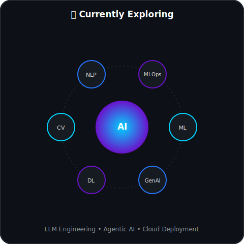

<!-- =============================================================== -->
<!--                         HEADER                                  -->
<!-- =============================================================== -->

<p align="center">

</p>

<p align="center">

</p>

<p align="center">
<a href="https://www.linkedin.com/in/sandeep-kumar-r21831301"></a>
<a href="https://github.com/Sandeep37-s"></a>
<a href="mailto:sandeep22112002@gmail.com"></a>

</p>

<p align="center">

</p>

---

## 🚀 About Me

```python
class Sandeep:

    def __init__(self):
        self.role = "AI Engineer"
        self.education = "B.Tech Computer Science & Engineering"
        self.university = "Central University of Jammu"

        self.skills = [
            "Machine Learning", "Deep Learning", "Generative AI",
            "Computer Vision", "NLP", "Python"
        ]

        self.learning = [
            "LLM Engineering", "Agentic AI",
            "MLOps", "Cloud Deployment"
        ]

        self.fun_fact = "Captain of B.Tech Kabaddi Team 🏆"

    def motto(self):
        return "Keep Learning • Keep Building 🚀"


me = Sandeep()
print(me.motto())
```

---

## 🛠️ Tech Stack

<p align="center">

</p>

<p align="center">


</p>

---

## ⚡ Skill Proficiency

<p align="center">

</p>

---

## 🌐 Currently Exploring

<p align="center">

</p>

---

## 🚀 Featured Projects

<table align="center">
<tr>
<td width="50%" valign="top">

### 🦁 WildGuard AI
AI-powered Wildlife Crime Reporting System
<br/> 

</td>
<td width="50%" valign="top">

### ❤️ AyuScan
AI Health Analyzer using Computer Vision
<br/> 

</td>
</tr>
<tr>
<td width="50%" valign="top">

### 📄 RAG PDF Reader
Chat with PDFs using LangChain + LLM
<br/> 

</td>
<td width="50%" valign="top">

### 📈 Financial Research Agent
Multi-Agent AI Research Platform
<br/> 

</td>
</tr>
</table>

---

## 🌐 Connect With Me

<p align="center">
<a href="https://www.linkedin.com/in/sandeep-kumar-r21831301">

</a>
&nbsp;&nbsp;&nbsp;
<a href="https://github.com/Sandeep37-s">

</a>
&nbsp;&nbsp;&nbsp;
<a href="mailto:sandeep22112002@gmail.com">

</a>
</p>

---

## 👀 Visitors

<p align="center">

</p>

---

<h2 align="center">⭐ Thanks for visiting my profile! ⭐</h2>

<p align="center">

</p>
